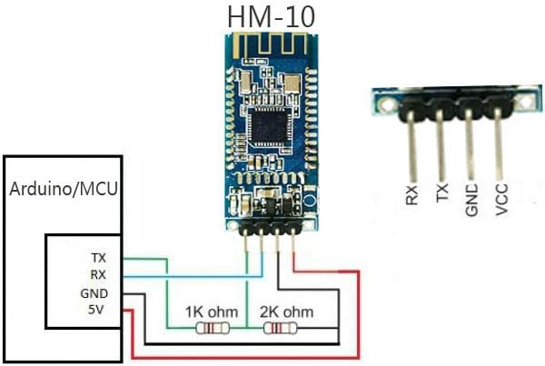
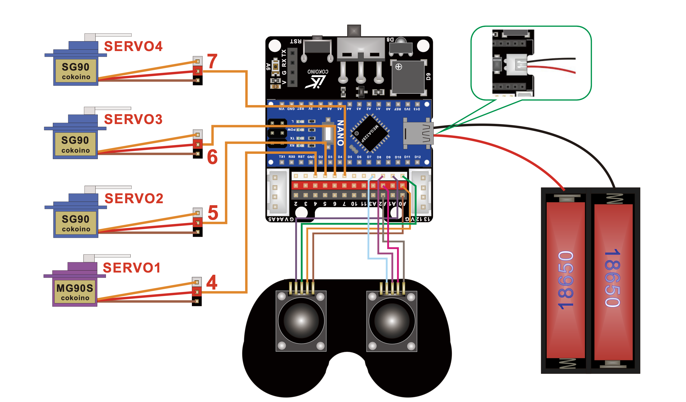
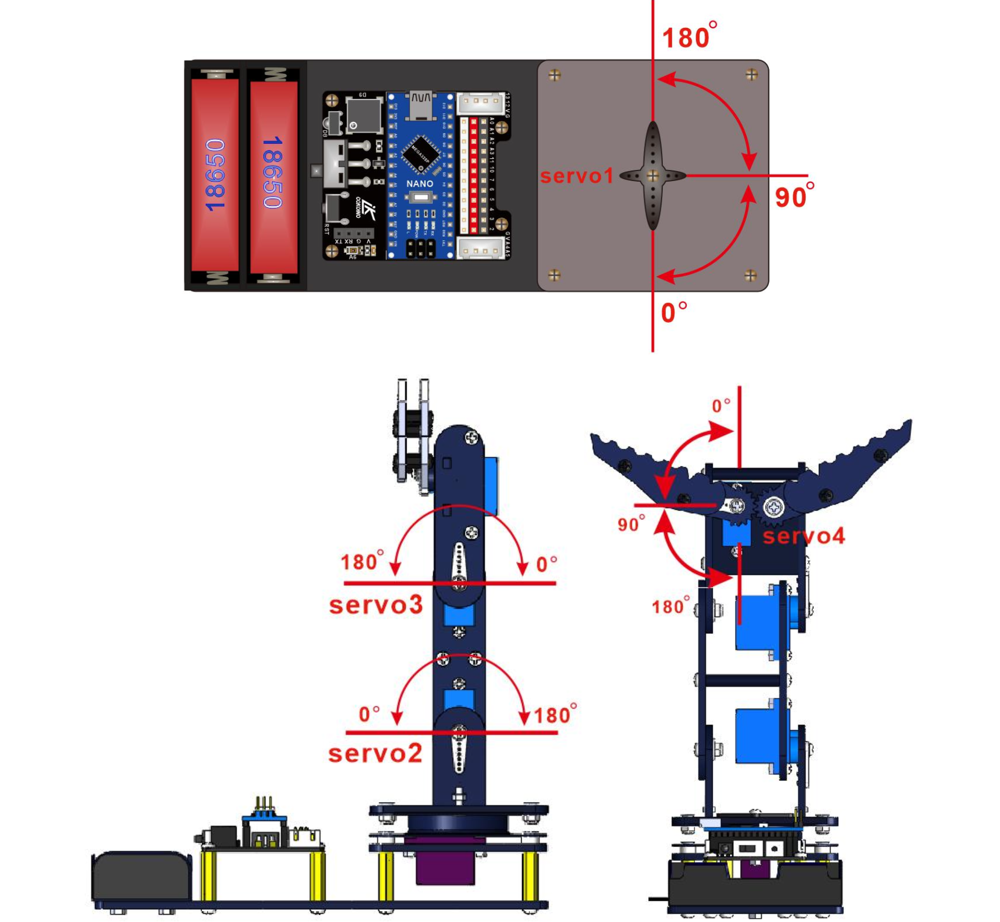

# Bluethooth Arm Controlled by iPhone


| **Engineer** | **School** | **Area of Interest** | **Grade** |
|:--:|:--:|:--:|:--:|
| Maksim R | Pinnacle High School | Mechincal Engineering | Incoming Junior


 

<!--- 
# Final Milestone

**Don't forget to replace the text below with the embedding for your milestone video. Go to YouTube, click Share -> Embed, and copy and paste the code to replace what's below.**

<iframe width="560" height="315" src="https://www.youtube.com/embed/F7M7imOVGug" title="YouTube video player" frameborder="0" allow="accelerometer; autoplay; clipboard-write; encrypted-media; gyroscope; picture-in-picture; web-share" allowfullscreen></iframe>

For your final milestone, explain the outcome of your project. Key details to include are:
- What you've accomplished since your previous milestone
- What your biggest challenges and triumphs were at BSE
- A summary of key topics you learned about
- What you hope to learn in the future after everything you've learned at BSE

-->

# Second Milestone


<iframe width="560" height="315" src="https://www.youtube.com/embed/5vV-AcF4DRU?si=Ut-Z7bL2yFteAWOz" title="YouTube video player" frameborder="0" allow="accelerometer; autoplay; clipboard-write; encrypted-media; gyroscope; picture-in-picture; web-share" referrerpolicy="strict-origin-when-cross-origin" allowfullscreen></iframe>

## Summary

  For my second milestone, I added Bluetooth control using an HM-10 and a Bluetooth terminal app called BluetoothLE. In the app, I preprogrammed buttons to send commands to the Bluetooth chip for easier control. I plugged the Bluetooth chip into the expansion board that came in the kit to power it.

## Challenges 

  I had to alter my code to control the robot via Bluetooth significantly. Initially, I faced issues with maintaining stable movements from the servos. I switched the base servo to a higher torque model to fix this. For my final milestone, I will construct a robot car that can also be controlled via Bluetooth, aiming to integrate the arm and car into one cohesive unit.

## Schematics 




## Code
```c++
#include <Servo.h>
#include <SoftwareSerial.h>

// Define servo objects
Servo yawServo;
Servo baseServo;
Servo wristServo;
Servo clawServo;

// Define servo pins
const int yawPin = 4; 
const int basePin = 5;
const int wristPin = 6;
const int clawPin = 7;

// Create SoftwareSerial object for Bluetooth
SoftwareSerial BTSerial(2, 3); // RX, TX

void setup() {
  yawServo.attach(yawPin);
  baseServo.attach(basePin);
  wristServo.attach(wristPin);
  clawServo.attach(clawPin);
  
  // Initialize servo positions
  yawServo.write(90);   // Initial position for yaw servo
  baseServo.write(90);  // Initial position for base servo
  wristServo.write(90); // Initial position for wrist servo
  clawServo.write(0);   // Initial position for claw servo

  // Begin serial communication
  Serial.begin(9600);  
  BTSerial.begin(9600);  

  Serial.println("Send 'o' to open, 'c' to close the claw, 's' to move yaw right, 't' to move yaw left, 'a' to move base up, 'b' to move base down, 'u' to move wrist up, and 'd' to move wrist down.");
}

void loop() {
  if (BTSerial.available()) {  // Check if there's any data available on the Bluetooth serial port
    char command = BTSerial.read();  // Read the incoming byte

    // Print the received command to the Serial Monitor
    Serial.print("Received command: ");
    Serial.println(command);

    if (command == 'o') {
      clawServo.write(100);  // Move the claw servo to 100 degrees
      Serial.println("Claw servo opened.");
    } else if (command == 'c') {
      clawServo.write(0);  // Move the claw servo to 0 degrees
      Serial.println("Claw servo closed.");
    } else if (command == 's') {
      int newYawPosition = yawServo.read() + 10; // Increase the yaw position by 10 degrees
      if (newYawPosition > 180) {
        newYawPosition = 180; // Limit to max 180 degrees
      }
      yawServo.write(newYawPosition);  // Move the yaw servo to the new position
      Serial.print("Yaw servo moved to ");
      Serial.println(newYawPosition);
    } else if (command == 't') {
      int newYawPosition = yawServo.read() - 10; // Decrease the yaw position by 10 degrees
      if (newYawPosition < 0) {
        newYawPosition = 0; // Limit to min 0 degrees
      }
      yawServo.write(newYawPosition);  // Move the yaw servo to the new position
      Serial.print("Yaw servo moved to ");
      Serial.println(newYawPosition);
    } else if (command == 'a') {
      int newBasePosition = baseServo.read() + 5; // Increase the base position by 5 degrees
      if (newBasePosition > 180) {
        newBasePosition = 180; // Limit to max 180 degrees
      }
      baseServo.write(newBasePosition);  // Move the base servo to the new position
      Serial.print("Base servo moved to ");
      Serial.println(newBasePosition);
    } else if (command == 'b') {
      int newBasePosition = baseServo.read() - 5; // Decrease the base position by 5 degrees
      if (newBasePosition < 0) {
        newBasePosition = 0; // Limit to min 0 degrees
      }
      baseServo.write(newBasePosition);  // Move the base servo to the new position
      Serial.print("Base servo moved to ");
      Serial.println(newBasePosition);
    } else if (command == 'u') {
      int newWristPosition = wristServo.read() + 5 // Increase the wrist position by 5 degrees
      if (newWristPosition > 180) {
        newWristPosition = 180; // Limit to max 180 degrees
      }
      wristServo.write(newWristPosition);  // Move the wrist servo to the new position
      Serial.print("Wrist servo moved to ");
      Serial.println(newWristPosition);
    } else if (command == 'd') {
      int newWristPosition = wristServo.read() - 5; // Decrease the wrist position by 5 degrees
      if (newWristPosition < 0) {
        newWristPosition = 0; // Limit to min 0 degrees
      }
      wristServo.write(newWristPosition);  // Move the wrist servo to the new position
      Serial.print("Wrist servo moved to ");
      Serial.println(newWristPosition);  
    } else {
      Serial.println("Unknown command. Send 'o' to open or 'c' to close the claw, 's' to move yaw right, 't' to move yaw left, 'a' to move base up, 'b' to move base down, 'u' to move wrist up, and 'd' to move wrist down.");
    }
  }
}
```
# First Milestone


<iframe width="560" height="315" src="https://www.youtube.com/embed/pl3rsx-9awk?si=rAK55ilik1rxmmjO" title="YouTube video player" frameborder="0" allow="accelerometer; autoplay; clipboard-write; encrypted-media; gyroscope; picture-in-picture; web-share" referrerpolicy="strict-origin-when-cross-origin" allowfullscreen></iframe>

## Summary

 For my first milestone, I developed a working prototype of a robotic arm powered by my MacBook and a 7.5V power supply. The Arduino Nano controls four servos (Yaw, Arm, Wrist, and Claw) based on joystick input.

## Challenges

I faced issues with powering the arm, as the servos could draw 0.5 amps, causing the system to shut down. Additionally, the servos had to be replaced due to their weakness. Despite these challenges, I controlled the base, arm, wrist, and claw movements.

## Schematics 




## Code


```c++
#include <Servo.h>

Servo yaw;
Servo base;
Servo wrist;
Servo claw;

void setup(){
    yaw.attach(4);
    base.attach(5);
    wrist.attach(6);
    claw.attach(7);
    Serial.begin(9600);
} 

int process_joystick(int reading){
  int new_reading = reading / 100;
  new_reading  = new_reading - 5;
  if (new_reading >= -2 && new_reading <= 2){
    new_reading = 0;
  }
  return new_reading;
}

void loop(){
  int LX = process_joystick(analogRead(A0));
  int LY = process_joystick(analogRead(A1));
  int RX = process_joystick(analogRead(A2));
  int RY = process_joystick(analogRead(A3));
  yaw.write(yaw.read()+ LX);
  base.write(base.read() + LY);
  wrist.write(wrist.read()+ RX);
  claw.write(claw.read()+ RY);
  delay(30);
}
```
# Starter Project


<iframe width="560" height="315" src="https://www.youtube.com/embed/u_1_Iifu6B8?si=Js_suB589OoiJRmY" title="YouTube video player" frameborder="0" allow="accelerometer; autoplay; clipboard-write; encrypted-media; gyroscope; picture-in-picture; web-share" referrerpolicy="strict-origin-when-cross-origin" allowfullscreen></iframe>

## Overview

- I created a Light Emitting Diode that is controlled by a board
- It has 5 parts: 1 LED, 3 sliders, 1 PCB
- Soldering with different soldering iron

## Summary
- Light-emitting diodes work by having three smaller lights inside. One red, one blue, and one green. Each light is controlled via voltage to control its brightness. Together, this creates a light that can be any color. In this project, the user controls the light via sliders.  


# Bill of Materials

| **Part** | **Note** | **Price** | **Link** |
|:--:|:--:|:--:|:--:|
| Robotic Arm Kit | Robotic Arm | $50 | <a href="https://www.amazon.com/LK-COKOINO-Compliment-Engineering-Technology/dp/B081FG1JQ1/ref=sr_1_10?crid=WOVIRMUC5Z0N&dib=eyJ2IjoiMSJ9.34Z0NK-7tSRlaNAlEFUFR30lLL7YyVqbvCA9h-Gjk9lg98-cVnL7IoihuMZ1NLulfPu4A33dcLUkdV4FMVKQzGmHKOjyC3khE2RnTvbq9Qmu3NVuOqUGokqjZx8w28kHw9LUvCCfNP2LdsIhP8B4cq-UOlRJB6hbbayc4aKvbVP3EVDO2ugA9RYGlOcbtSNnCar8YyC1J981eHntgxodqxtIse-nj_I4FizvDMBAdc533N9XJewmk_JyNJQpmeqY_aEdWnBpre4sMiA1cnclOt_xkXSdBOktCfimR-gg59M.JDhe_QES4oqdcs7qz0fcG3TF8GqKf9Q8y3arV6O4D0E&dib_tag=se&keywords=robotic+arm+cokion&qid=1720630693&sprefix=robotic+arm+cokion%2Caps%2C120&sr=8-10"> Link </a> |
| HM-10 | Bluethooth Chip | $12 | <a href="[https://www.amazon.com/Arduino-A000066-ARDUINO-UNO-R3/dp/B008GRTSV6/](https://www.amazon.com/DSD-TECH-Bluetooth-iBeacon-Arduino/dp/B06WGZB2N4/ref=sr_1_1_sspa?crid=51SK7AJULZ6M&dib=eyJ2IjoiMSJ9.1ybVTZJyEtfPa6-bhIJc5WwymCqDa2jd9NGBJSgWHopVAR4JNebELBT2Sahzs7jA_P1KaFUkJ46G8EFQBtkCLxJmA1fU4o7yPhfIZsx2_5YzDu6lOACCFlDKc5sRXGdW5Fz90i0mPfp78UnlCkO5Z-m8RrwN6meDluYiDwo1_xwaDWQOXgEeq5GbI6JJ3_SXWmD2PKywq9YutyXmLfgR4-Znn-jHZHjzSKZCA5BCF5565w8skNJa7J2AFYrAr3_3wEUQ_9Ux5QkHzDiGVETXkXMavtT_m4Fs0q4A45SrE6A.VjdXPKAgQtWYIYjGuS2HWLNkD6K_sPkY5zXz7juO0vU&dib_tag=se&keywords=hm-10&qid=1720629779&sprefix=hm-10%2Caps%2C122&sr=8-1-spons&sp_csd=d2lkZ2V0TmFtZT1zcF9hdGY&psc=1)"> Link </a> |
| Item Name | What the item is used for | $Price | <a href="https://www.amazon.com/Arduino-A000066-ARDUINO-UNO-R3/dp/B008GRTSV6/"> Link </a> |

<!-- 
# Other Resources/Examples
One of the best parts about Github is that you can view how other people set up their own work. Here are some past BSE portfolios that are awesome examples. You can view how they set up their portfolio, and you can view their index.md files to understand how they implemented different portfolio components.
- [Example 1](https://trashytuber.github.io/YimingJiaBlueStamp/)
- [Example 2](https://sviatil0.github.io/Sviatoslav_BSE/)
- [Example 3](https://arneshkumar.github.io/arneshbluestamp/)

To watch the BSE tutorial on how to create a portfolio, click here. -->
